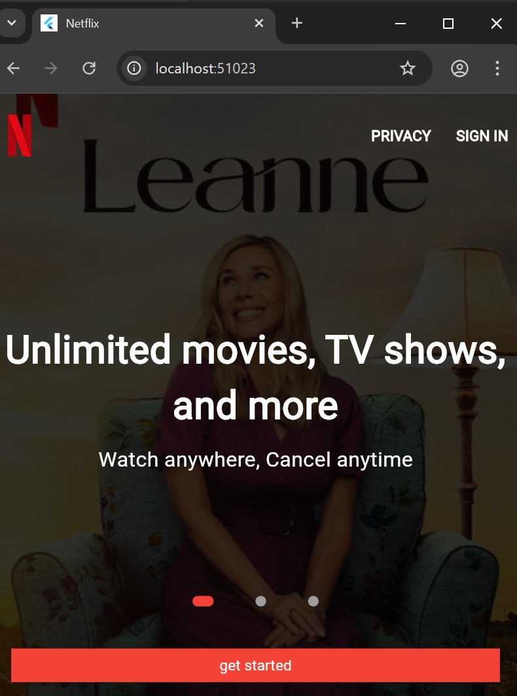
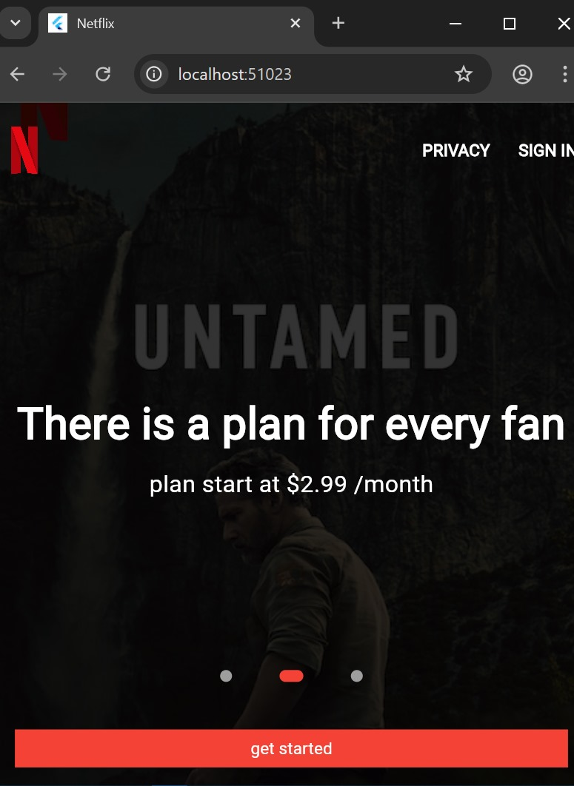

# 🎬 Netflix Clone Flutter

🚀 Un clone de l’application Netflix développé en Flutter, comme projet de fin de formation.

## 📱 Aperçu du projet

- ✅ Splash Screen animé (Lottie)
- ✅ Page d'onboarding
- ✅ Page de connexion responsive
- 🔜 Écran d’accueil
- 🔜 Navigation dynamique
- 🔜 Intégration de contenus vidéo

## 🎯 Objectifs

- Approfondir mes compétences en Flutter
- Travailler le design UI/UX
- M’exercer sur la logique d’une application mobile complète
- Découvrir les bonnes pratiques de développement mobile

## 📷 Captures d’écran

> 
> 
> 

## 🚧 En cours

- [ ] Accueil personnalisé
- [ ] Lecture vidéo avec contrôles
- [ ] Responsive design optimisé tablette

## 🛠️ Technologies utilisées

- Flutter
- Dart
- Lottie
- Firebase (si prévu pour auth plus tard)
- GitHub

## 👨‍💻 Auteur

👋 Développé par [Light DJOSSOU](https://www.linkedin.com/in/kokou-light-djossou-90216233b?utm_source=share&utm_campaign=share_via&utm_content=profile&utm_medium=ios_app), étudiant en Intelligence Artificielle et passionné par le développement mobile et web.

---
